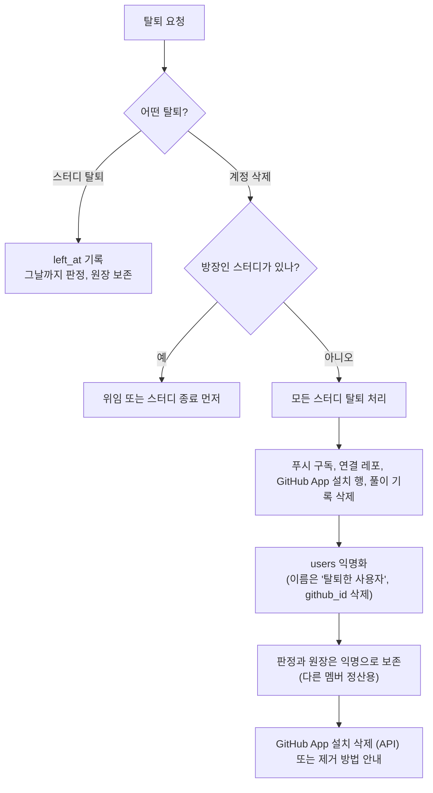

# 5.16 탈퇴와 계정 삭제 (P1)

**목적:** 개인정보는 지우고, 다른 멤버의 정산 기록은 지킨다.

```mermaid
flowchart TD
    A["탈퇴 요청"] --> B{"어떤 탈퇴?"}
    B -->|" 스터디 탈퇴 "| C["left_at 기록<br/>그날까지 판정, 원장 보존"]
    B -->|" 계정 삭제 "| D{"방장인 스터디가 있나?"}
    D -->|" 예 "| E["위임 또는 스터디 종료 먼저"]
    D -->|" 아니오 "| F["모든 스터디 탈퇴 처리"]
    F --> G["푸시 구독, 연결 레포, GitHub App 설치 행, 풀이 기록 삭제"]
    G --> H["users 익명화<br/>(이름은 '탈퇴한 사용자', github_id 삭제)"]
    H --> I["판정과 원장은 익명으로 보존<br/>(다른 멤버 정산용)"]
    I --> J["GitHub App 설치 삭제 (API) 또는 제거 방법 안내"]
```

**주의할 것**

- 무엇을 지우고 무엇을 남기는지 개인정보처리방침 (9.8)에 적어요.
- 판정과 원장을 통째로 지우면 다른 멤버의 정산이 맞지 않게 돼요. 그래서 사람만 알아볼 수 없게 익명화해요.

**테스트:** T30
